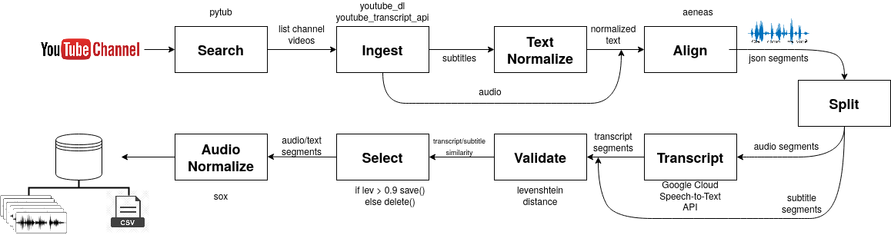

# KATube - KATube Audio dataset creator from youTube

KATube is a tool to automate the process of creating datasets for training Text-To-Speech (TTS) and Speech-To-Text (STT) models. It is based on the work of Pansori [https://arxiv.org/abs/1812.09798]. 


From a list of YouTube playlists or YouTube channels, KATube downloads all audios with their respective subtitles, segments the audios, performing audio-text alignment using the external tool [AENEAS](https://github.com/readbeyond/aeneas). From this alignment, KATube will segment the audio, according to the sentences created.

Finally, a validation step can be performed. For this, KATube must use an external translation tool STT (not available here). This validation will calculate the similarity between the subtitle and the transcript, using the [Levenshtein distance](https://en.wikipedia.org/wiki/Levenshtein_distance). This step ensures that the subtitle and the transcript are correct. KATube can be configured to perform a last selection step, in which will be discard audios that do not have a minimum guarantee of similarity between the sentence and the transcript.

Use at your own risk.



## Search and Ingest Videos

In the first stage, KATube performs two procedures: search and download. The search is done by a function that uses the youtube api, so you will need an [api key](https://developers.google.com/places/web-service/get-api-key) to perform this functionality. The search function receives the id of a youtube channel, the api key and returns a list of all the videos available on that channel. This functionality is provided by the script named "search.py" and can be used separately. Execute the script using as input argument the api_key of the google account, the youtube channel id (or playlist id), the output directory, and the output file name. For example:

```
$ python search.py --api_key=GOOGLE_DEVELOPER_API_KEY --content_id=CHANNEL_ID --dest_dir=OUTPUT_FOLDER --output_search_file=YOUTUBE_VIDEOS.txt
```

Then, a function is used to download audio and subtitles from online videos as .mp3 and .srt files, respectively. This process can be time consuming, as it is necessary to wait a few seconds (a value between 30 and 60 seconds set at random) to avoid blocking the IP by the Youtube servers. This functionality is provided by the script named "download.py" and can be used separately. Execute the script using as input argument the URL of the youtube video and the destination directory. For example:

```
$ python download.py --youtube_url=https://www.youtube.com/watch?v=999999999 --output_dir=OUTPUT_FOLDER
```

Two files will be created: one .srt and the other .mp3. The names of the files will be the same as the video ID, which is the code after the URL, for example https://<www.youtube.com/watch?v=VIDEO_ID>.

## Cleaning and Normalization of the text

The subtitles contain segmented text and timing information which corresponds to the audio contents of the associated video. THe timing subtitles is discarded and subtitles are joined. The text corresponding to the sentences is cleaned, normalized and divided into sentences, according to the punctuation. The division of sentences will try to respect the limits defined by the minimum and maximum number of words previously defined. If it is not possible to respect these limits by segmenting the text in the punctuation, the text will be segmented in an arbitrary manner, regardless of the punctuation.

This functionality is provided by the script named "text_normalization.py" and can be used separately. Run the script using as input argument the subtitles filepath, the minimal and maximal number of words on sentence, and the output filepath. For example:

```
$ python text_normalization.py --input_file=SUBTITLES.txt --min_words=10 --max_words=30 --output_file=CLEAN_AND_NORMALIZED_SUBTITLES.txt
```

## Align (Synchronization) Text-Audio 

For alignment, the AENEAS tool is used, which receives an audio file and the clean and normalized text, divided into sentences. A json file will be produced and contains the time (begin and end) of each sentence in the text. The audio file must be in wav or mp3 format. The text is divided into sentences, one on each line of a txt file. For more information about the AENEAS operation, check the [oficial documentation](https://pypi.org/project/aeneas/).

This functionality is provided by the script named "synchronization.py" and can be used separately. Execute the script using as input argument the audio filepath (mp3 or wav), the text filepath, which contains the segmented sentences, and the output filepath, in which the .json file resulting from the alignment produced by the AENEAS tool will be saved. For example:

```
$ python synchronization.py --audio_file=AUDIO_FILE.mp3 --text_file=CLEAN_AND_NORMALIZED_SUBTITLES.txt --output_file=SYNCHRONIZED_AUDIO_TEXT.json
```

## Audio Segmentation

This step receives the json file from the previous step and performs the segmentation of the audio file. This script is based on the script provided by [Keith Ito](https://keithito.com), who kindly provided it via email. In this step, a logical list of segments is first created, storing the filename, the start and end times. Then, go through this logical list, dividing the original audio, saving each segment to disk. 

This functionality is provided by the script named "audio_segmentation.py" and can be used separately. Run the script using as input argument the path of the audio file (mp3 or wav) to be segmented, the json file from the previous step, the output directory, where the segmented files will be saved, and the path of the metadata file, which is a csv file that will contain the name of the segmented audio file and the corresponding text. For example:

```
$ python audio_segmentation.py --audio_file=AUDIO_FILE.mp3 --json_file=SYNCHRONIZED_AUDIO_TEXT.json --output_dir=OUTPUT_FOLDER --metadata_file=METADATA.CSV
```

The output file will follow the template:

```
filename1 | text one
filename2 | text two
filename3 | text three
filename4 | text four
```

## Transcribe

Here there is a script template to access an external STT API, if you have it available. You need to configure the link to access the API. Adapt this script as needed. A sample rate conversion function is also available, in case it is necessary to convert the files before using the STT API. This functionality is provided by the script named "transcribe.py" and can be used separately. Run the script using as input argument of the input directory of wavs files, the transcription output file, and the new sample rate, which the wav files will be converted before sending to the STT API. For example:

```
$ python transcribe.py --input_dir=WAVS_FOLDER --new_sample_rate=16000 --transcription_file=TRANSCRIPTS.CSV
```

## Validation

Although the audio and text data are force-aligned with each other, several problems can happen that prejudices the results.
The text may be unclean or incorrect, the pronunciation may be erroneous or the audio may be corrupted (like ambient noise or poor recording quality).

KATube can validate the text of the sentence. To do this, you must have available an external STT (not provided here), such as AWS, Google or Azure. Some sample scripts are available in the "tools" folder.  The external STT will generate a transcript of the segmented audio. So, you can compare the sentence with the transcript using the levenshtein distance, and thus have a guarantee that the audio really matches the text of the sentence.

This functionality is provided by the script named "validation.py" and can be used separately. Run the script using as input argument the paths of two csv metadata files, the output directory and the path of the output file, which will contain the texts and the Levenshtein distance between them. For example:

```
$ python validation.py --input_file1=METADATA.CSV --input_file2=TRANSCRIPTS.CSV --output_dir=OUTPUT_FOLDER --output_file=VALIDATION.csv
```

## Selection

After validating the data it is possible to select only those audios that have a minimal similarity between the transcription and the sentence. KATube can discard audios that have a similarity value less than a value you define (90% is a good start).

This functionality is provided by the script named "selection.py" and can be used separately. Run the script using as input argument the path of the csv validation file, from the previews step, the minimal value of Levenshtein distance, and the result output file. A security parameter (--force) must be passed in order to effectively delete the files with lower value of Levenshtein distance. For example:

```
$ python selection.py --csv_file=VALIDATION.csv --min_value=0.9 --save_file=METADATA.csv --force
```

# Installation

## How to create a docker image

```sh
$ git clone https://github.com/freds0/katube
$ cd katube
$ docker build -t katube ./
$ sudo docker run --rm --net='host' -e LANG=C.UTF-8 -e LC_ALL=C.UTF-8 -v ~/:/root/ -w /root -it  katube
```

If you prefer, use a conda environment:

```sh
$ conda create -n katube python=3.6 pip
$ conda activate katube
```

## Aeneas Installation

Install the requirements:

```sh
$ apt-get install ffmpeg espeak libespeak-dev wget git
$ wget https://raw.githubusercontent.com/readbeyond/aeneas/master/install_dependencies.sh
$ bash install_dependencies.sh
```

Install Aeneas:

```sh
$ git clone https://github.com/ReadBeyond/aeneas.git
$ cd aeneas
$ sudo pip install -r requirements.txt
$ python setup.py build_ext --inplace
$ python aeneas_check_setup.py
$ cd ..
$ pip install -e aeneas
```

## KATube Installation

Install the KATube requirements:

```sh
$ pip install -r requirements.txt
$ pip install git+https://github.com/freds0/pytube3
or
$ pip install git+https://github.com/swiftyy-mage/pytube3
```

# Configuration

First, create your google api_key at:

[https://developers.google.com/places/web-service/get-api-key]

In the "config.py" file, set the variable with your google_id:

```sh
api_key = 'put_your_google_id_here'
```

Second, in the "config.py" file, choose the source to download the audio data:

 - playlist 
 - channel
 
If you choose a playlist, set variable orig_base as follows in the config.py file: 

```sh
orig_base = 'playlist' # ['channel', 'playlist'] 
```

Third, create a list containing the playlist or channel ids from youtube. For example, to download all audios from the playlist
 - <https://www.youtube.com/playlist?list=PLZoTAELRMXVPGU70ZGsckrMdr0FteeRUi>
 

Configure the file "input/playlists_id.txt" as follows:

```sh
PLZoTAELRMXVPGU70ZGsckrMdr0FteeRUi
```

Check the settings in the "config.py" file.

# Execution

After the configuration, execute the command:

```
python main.py
```

and KATube will start dataset generating. 

# TODO

Try to use [Montreal Forced Alignment](https://montreal-forced-aligner.readthedocs.io/en/latest/).

# References:

- Pansori [sourcecode](https://github.com/yc9701/pansori)
- Pansori [paper](https://arxiv.org/abs/1812.09798)
- [KABooks](https://github.com/freds0/kabooks), our similar tool, used to create dataset from audiobooks.

# Thanks

- [Keith Ito](https://keithito.com)
